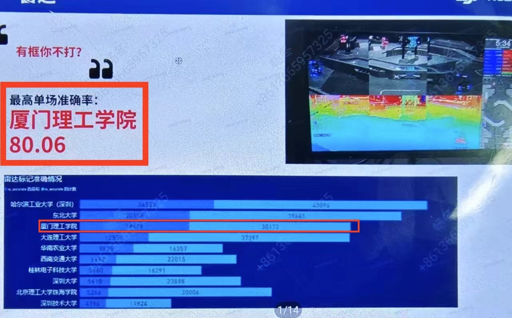
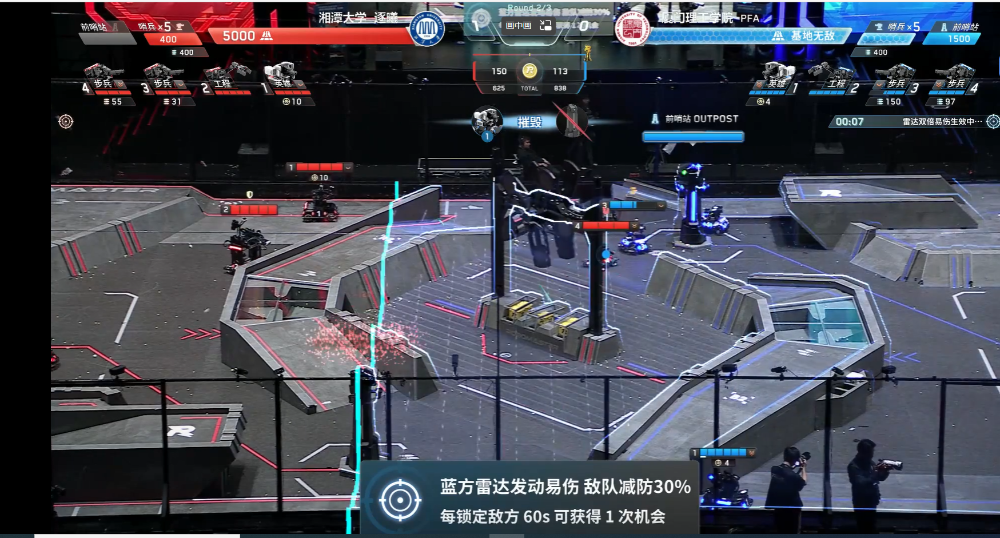
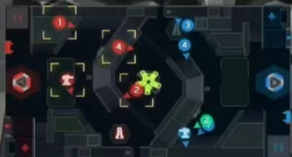
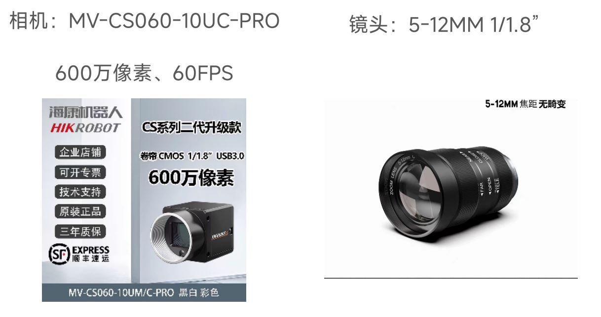
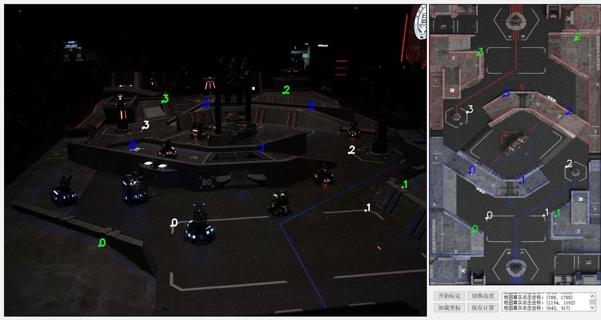
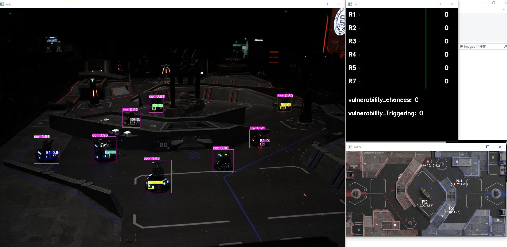
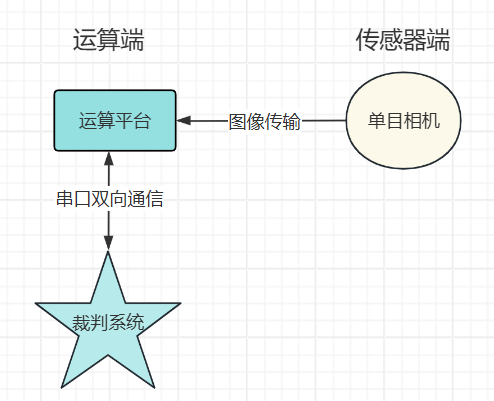
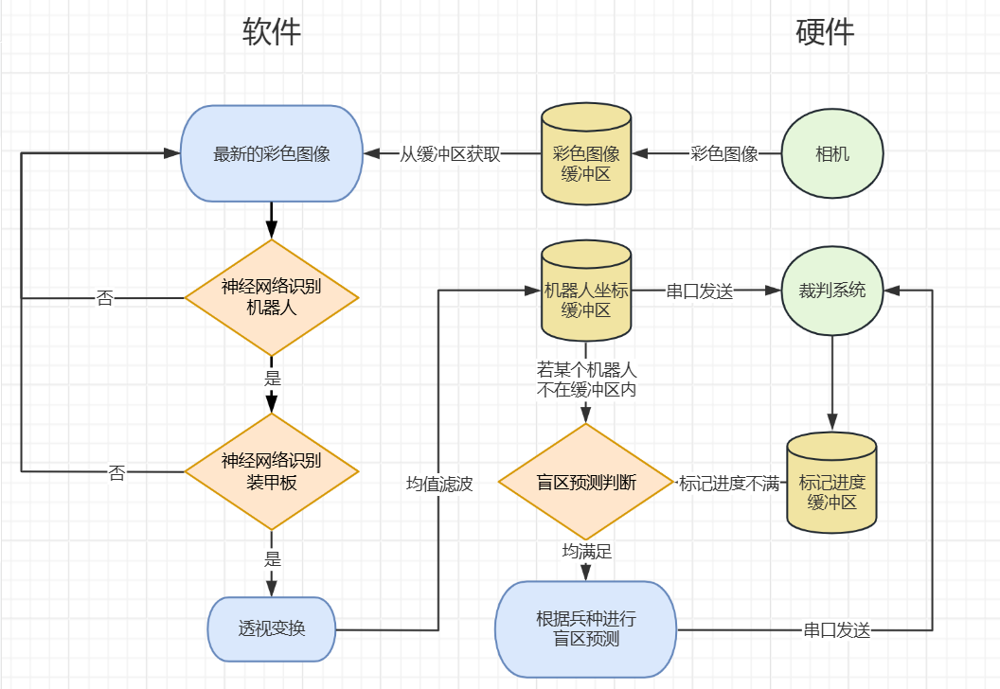

# 厦门理工学院PFA战队单目相机雷达站算法开源（含机器人、装甲板识别模型）
 **【已更新最新的串口通信协议，国赛即插即用！！！】** 


【全场透视！979.6s有效标记定位！｜厦门理工学院雷达机器人研发方案分享】 https://www.bilibili.com/video/BV1jD421g7ab/


【RoboMaster2024青年工程师大会｜厦门理工学院雷达视觉算法设计思路分享】 https://www.bilibili.com/video/BV1uJ4m137uh/

#### 功能介绍

基于此算法，使用 **任意单目相机** 和 **任意运算端** ，即可实现 **雷达站的所有功能** ，主要功能如下：
1. 机器人精确定位
2. 视野盲区预测（辽科雷达方案优化）
3. 标记进度显示
4. 自主发动双倍易伤
5. 裁判系统双向通信
6. 支持USB相机和海康相机


#### 效果展示
1. 场均标点**全国一等奖**

2. 南部赛区累计标点数第三

3. 比赛大部分时间全场高亮、主动发动双倍易伤




#### 软件依赖
1. Python3.9
2. Windows10、Linux（Ubuntu支持，其他Linux系统可能需要适配）


#### 硬件要求
1. 海康工业相机/USB直驱相机
2. USB串口（另一头需接裁判系统user串口）
3. 有GPU的运算端，推荐RTX3060以上
4. 推荐配置：相机MV-CS060-10UC-PRO（USB款），镜头5-12ｍｍ（6ｍｍ最佳）



#### 配置环境
1.  pip install -r requirements.txt 
2.  如需加速模型推理，请安装tensorrt版本8.6.1（安装教程网上有）
3.  安装好tensorrt后，运行onnx2engine.py,模型转换完成后，修改main.py 621行，更换为engine模型
4.  如需使用海康相机，请先安装好对应平台的MVS客户端，测试相机通过后再运行本项目


#### 标定指南
1. 每场比赛开始前，需对雷达进行标定，使用calibration.py 脚本，先修改参数后运行。
2. 选择标定模式（test':测试模式,'hik':海康相机,'video':USB相机（videocapture）），己方阵营（test模式只能为蓝方），calibration.py 360、362行
3. 运行calibration.py，将相机视角调节合适后，点击“开始标定”
4. 依次点击相机视图和地图视图 **地面** 对应对应的四组、八个点（白色）后，点击切换高度
5. 依次点击相机视图和地图视图 **R型高地** 对应对应的四组、八个点（绿色）后，点击切换高度
6. 依次点击相机视图和地图视图 **环型高地** 对应对应的四组、八个点后（蓝色），点击保存计算



#### 运行指南（标定完成后）
1. 更改main.py 628行的串口名（不使用串口测试的话请注释628-635行，这部分为串口收发线程）
2. 修改运行模式---'test':测试模式,'hik':海康相机,'video':USB相机（videocapture）main.py 627行，默认为test
3. 修改己方阵营，test模式只能为蓝方，main.py 17行
4. 运行main.py文件，出现如下图所示则运行成功（标记进度全为-1表示没有连接到裁判系统）

5. 在云台手端，切换飞镖锁定目标触发双倍易伤
6. 如果运行帧率太低，1fps左右，考虑是torch或者onnx没有安装GPU版本，如果不行，请转换为trt模型加速推理


#### 文件目录结构


```
\---pfa_vision_radar
    |   arrays_test_blue.npy # 蓝方测试变换矩阵
    |   arrays_test_red.npy # 红方测试变换矩阵
    |   calibration.py # 标定部分代码
    |   detect_function.py # 目标检测代码封装
    |   export.py # 模型类型转换代码
    |   hik_camera.py # 海康相机支持代码
    |   information_ui.py # 裁判系统消息显示UI
    |   LICENSE # 开源许可
    |   main.py # 主程序运行代码
    |   onnx2engine.py # onnx模型转engine模型
    |   README.en.md
    |   README.md
    |   requirements.txt # 环境依赖文件
    |   test.py # 测试代码
    |
    +---images # 需求图片文件夹
    |       calibration.JPG # 标定
    |       image1.jpg
    |       image2.png
    |       image3.JPG
    |       image4.jpg
    |       map.jpg # 地图图片
    |       map_blue.jpg # 蓝方视角地图
    |       map_mask.jpg # 地图掩码（用于透视变换高度选择）
    |       map_red.jpg # 红方视角地图
    |       map_red_s_mask.jpg
    |       test_image.jpg # 测试鸟瞰图
    |       全国第一.jpg 
    |
    +---models
    |   |   armor.onnx # 装甲板识别模型
    |   |   car.onnx # 机器人识别模型
    |   |   common.py
    |   |   experimental.py
    |   |   yolo.py
    |   |
    |
    +---MvImport # 海康威视相机驱动代码
    |   |   CameraParams_const.py
    |   |   CameraParams_header.py
    |   |   MvCameraControl_class.py
    |   |   MvErrorDefine_const.py
    |   |   PixelType_header.py
    |   |
    |
    +---RM_serial_py # RM裁判系统通信代码
    |   |   example_receive.py # 接收示例代码
    |   |   example_send.py # 发送示例代码
    |   |   ser_api.py # 裁判系统通信代码函数封装
    |   |
    |
    +---utils # YOLOv5目标检测工具包
    |   |   activations.py
    |   |   augmentations.py
    |   |   autoanchor.py
    |   |   autobatch.py
    |   |   callbacks.py
    |   |   dataloaders.py
    |   |   downloads.py
    |   |   general.py
    |   |   loss.py
    |   |   metrics.py
    |   |   plots.py
    |   |   torch_utils.py
    |   |   triton.py
    |   |   __init__.py
    |   |
    |   |
    |   +---segment
    |   |   |   augmentations.py
    |   |   |   dataloaders.py
    |   |   |   general.py
    |   |   |   loss.py
    |   |   |   metrics.py
    |   |   |   plots.py
    |   |   |   __init__.py
    |   |   |
    |   |
    |   
```


#### 原理介绍与理论支持
1. 目标检测基于计算机视觉业内成熟的网络YOLOv5优化而来，添加了小目标检测降采样层，提升小目标检测能力；采用双层神经网络，先检测机器人目标，再把机器人目标ROI出来，进行装甲板识别，实现超大范围的机器人目标及其装甲板的精确检测。
2. 机器人坐标定位基于OpenCV仿射变换，将鸟瞰图视角图像通过赛前标定的透视矩阵，转换为赛场地图视角图片，就能实现画面坐标与地图坐标的转换。无需其他设备，仅需一个单目相机即可实现。
3. 更多算法原理详情见文件（厦门理工学院-张凯瑜-雷达算法详解.pdf）

#### 系统框架



#### 软件框架



#### 未来优化方向
1. 优化神经网络，改用最新的YOLOv10或其他更强大的网络。
2. 融合deepsort目标跟踪算法，提升算法的轨迹预测、跟踪的能力。
3. 优化标定流程，加快标定速度，提升效率。
4. 适配更多型号的相机，提升代码的普适性。


#### 注意事项
1. 不仅可以tensorrt加速，理论上openvino也可以
2. 可以修改多个机器人都进行盲区预测
3. 遇到问题联系我，QQ：2728615481
4. 如果对你有帮助的话帮忙点个star

#### 已知问题及解决方法
1. 使用MV-CA016-10UC相机，Gain值设置失败，可以降低main.py 268行Gain的数值，或者直接注释掉该行


